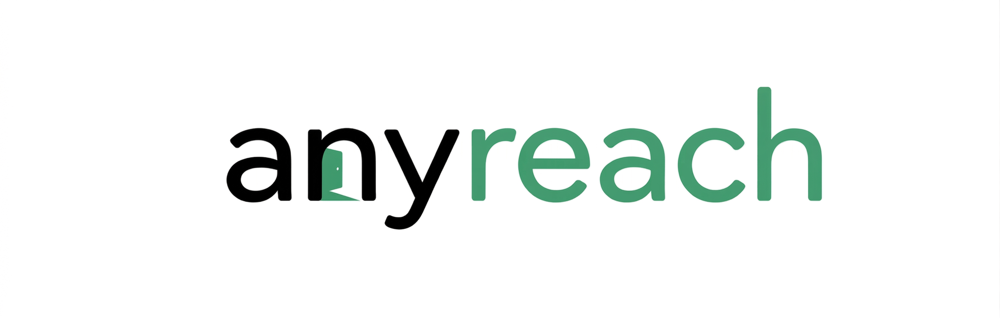
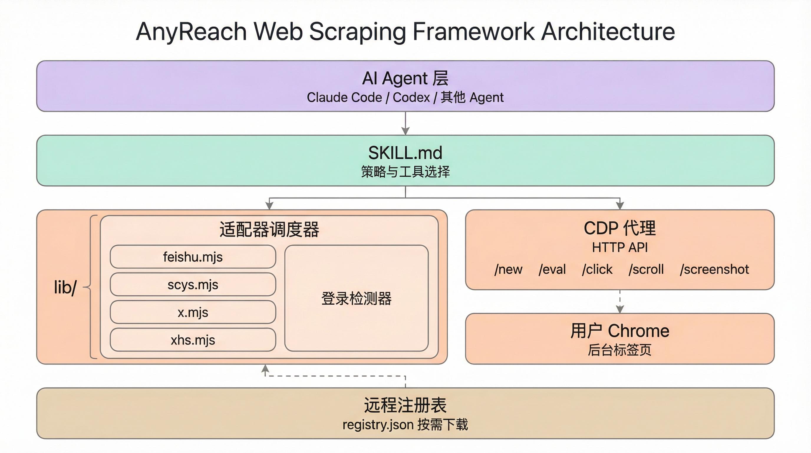

<div align="left">

[English](README_EN.md)

</div>

<div align="center">



<big><big><em>Bring agents anywhere.</em></big></big>

[](./LICENSE)
[](https://github.com/ayaoplus/anyreach)

[快速开始](#安装) · [CDP API](#cdp-proxy-api) · [适配器系统](#适配器系统) · [已有适配器](#已有适配器)

</div>

---

## 它做什么

AnyReach 将你的 AI Agent（Claude Code、Codex、OpenClaw）连接到你日常使用的 Chrome 浏览器。Agent 在后台标签页中操作——共享你的登录状态，对反爬检测不可见，不会抢占你的浏览器焦点。



三层站点知识体系：

| 层级 | 机制 | Token 消耗 | 适用场景 |
|------|------|-----------|---------|
| **代码适配器** (.mjs) | 确定性代码提取 | 零 | 有已知内部 API 的站点（如飞书的 `window.DATA`） |
| **提示文件** (.md) | 基于 prompt 的经验指引 | 低 | 有已知模式但不适合写固定脚本的站点 |
| **通用模式** | Agent 通过 `/eval` 实时编写 JS | 高 | 未知站点、一次性任务 |

---

## 安装

**让 Agent 自动安装：**

```
Install this skill: https://github.com/ayaoplus/anyreach
```

**手动安装：**

```bash
git clone https://github.com/ayaoplus/anyreach ~/anyreach
node ~/anyreach/scripts/install.mjs
```

安装会创建符号链接：
- `~/.claude/skills/anyreach` → Claude Code
- `~/.agents/skills/anyreach` → Codex + OpenClaw

一份代码，共享 `SKILL.md`，所有 Agent 都能加载。

### 前置条件

- **Node.js 22+**（使用原生 WebSocket）
- **Chrome** 开启远程调试：
  1. 打开 `chrome://inspect/#remote-debugging`
  2. 勾选 **"Allow remote debugging for this browser instance"**
  3. 如需要，重启 Chrome

### 验证

```bash
node ~/anyreach/scripts/check-deps.mjs
# 预期输出: node: ok, chrome: ok, proxy: ready
```

---

## 使用方式

安装后，直接对 Agent 说：

- *"读取这个页面：[URL]"*
- *"搜索小红书上的 X"*
- *"提取这个飞书文档的内容"*
- *"并行调研这 5 个竞品"*

Agent 会加载 SKILL.md，选择合适的工具（WebSearch / WebFetch / Jina / CDP），自动完成任务。

---

## CDP Proxy API

所有浏览器操作通过本地 HTTP 代理 `localhost:3456` 完成。

| 端点 | 方法 | 类别 | 参数 | 说明 |
|------|------|------|------|------|
| `/new` | GET | 标签页 | `url` — 目标 URL | 新建后台标签页，等待加载完成，返回 `{ targetId }` |
| `/close` | GET | 标签页 | `target` — 标签页 ID | 关闭标签页 |
| `/targets` | GET | 标签页 | 无 | 列出所有打开的标签页 |
| `/health` | GET | 标签页 | 无 | 查看连接状态、会话数、Chrome 端口 |
| `/eval` | POST | 交互 | `target`；body = JS 表达式 | 执行任意 JavaScript，支持 async/await |
| `/click` | POST | 交互 | `target`；body = CSS 选择器 | JS `el.click()`，覆盖大多数场景 |
| `/clickAt` | POST | 交互 | `target`；body = CSS 选择器 | 真实鼠标事件，可触发文件选择框 |
| `/fill` | POST | 交互 | `target`；body = `{ selector, value }` | 填写表单，兼容 React/Vue 响应式 |
| `/scroll` | GET | 交互 | `target`, `direction` (down/up/top/bottom), `y` | 滚动页面，等待 800ms 懒加载 |
| `/wheel` | GET | 交互 | `target`, `x`, `y`, `deltaY` | 真实滚轮手势，适用于虚拟列表 |
| `/extractText` | POST | 提取 | `target`；body = `{ selector, scroll }` | 自动滚动容器 + 遍历 DOM 提取文本 |
| `/screenshot` | GET | 提取 | `target`, `file` — 保存路径 | 截图，可保存到文件或返回二进制 |
| `/waitFor` | GET | 提取 | `target`, `selector`, `timeout` | 等待元素出现（MutationObserver），超时返回 408 |
| `/setCookie` | POST | Cookie | `target`；body = Cookie JSON | 注入 Cookie，支持 HttpOnly |
| `/getCookies` | GET | Cookie | `target`, `domain`（可选） | 获取 Cookie，可按域名过滤 |
| `/cdp` | POST | 高级 | `target`, `session`（可选）；body = `{ method, params }` | 发送任意 CDP 命令 |
| `/preScript` | POST | 高级 | `target`；body = JS 代码 | 注入页面前置脚本，每次导航自动执行 |
| `/adapter` | POST | 高级 | `url` | 匹配 URL 对应的适配器并执行提取 |
| `/events/start` | POST | 高级 | `target`；body = `{ filter, maxEvents }` | 开始收集 CDP 事件 |
| `/events/get` | GET | 高级 | `id`, `clear`（可选） | 获取收集到的事件 |
| `/events/stop` | GET | 高级 | `id` | 停止并移除收集器 |

**示例**

```bash
# 打开页面，拿到 targetId
curl -s "http://localhost:3456/new?url=https://example.com"
# → {"targetId":"ABC123"}

# 执行 JS 获取标题
curl -s -X POST "http://localhost:3456/eval?target=ABC123" -d 'document.title'

# 填写搜索框并点击提交
curl -s -X POST "http://localhost:3456/fill?target=ABC123" \
  -d '{"selector":"input[name=q]","value":"hello"}'
curl -s -X POST "http://localhost:3456/click?target=ABC123" -d '.submit-btn'

# 滚动加载后提取文章内容
curl -s -X POST "http://localhost:3456/extractText?target=ABC123" \
  -d '{"selector":"article","scroll":true}'

# 收集网络事件（用于恢复 API 响应）
curl -s -X POST "http://localhost:3456/events/start?target=ABC123" \
  -d '{"filter":"Network","maxEvents":500}'
# → {"collectorId":"COL_1"}
curl -s "http://localhost:3456/events/get?id=COL_1&clear=true"

# 用完关闭标签页
curl -s "http://localhost:3456/close?target=ABC123"
```

完整参考：[docs/architecture.md](docs/architecture.md)

---

## 适配器系统

四层解析：本地代码适配器 → 本地提示文件 → 远程注册表 → 通用 CDP 模式。

遇到远程适配器时自动下载到 `adapters/` 并执行，无需手动配置。

### 查看 URL 匹配情况

```bash
node scripts/adapter-runner.mjs check "https://feishu.cn/wiki/xxx"
# {"level":"adapter","name":"feishu",...}

node scripts/adapter-runner.mjs check "https://unknown-site.com"
# {"level":"none"}
```

### 运行适配器

```bash
node scripts/adapter-runner.mjs run "https://feishu.cn/wiki/xxx"
# 返回结构化 JSON（title, content, metadata）
```

### 编写自己的适配器

复制 `adapters/_template.mjs`：

```javascript
export default {
  name: 'mysite',
  domains: ['mysite.com'],
  description: '从 mysite 提取文章',

  detect(url) {
    if (url.includes('/post/')) return 'post';
    return 'default';
  },

  async extract(proxy, targetId, ctx) {
    const title = await proxy.eval(targetId, 'document.title');
    const { text } = await proxy.extractText(targetId, { selector: 'article' });
    return { title, content: text, format: 'text' };
  },
};
```

---

## 已有适配器

| 适配器 | 域名 | 能力 |
|--------|------|------|
| [**feishu**](docs/adapter-feishu.md) | feishu.cn, larksuite.com | 知识库/云文档提取。通过 `window.DATA` block 数据 + Worker 拦截实现长文档完整提取。支持所有 block 类型（标题、列表、图片、表格、高亮块、引用等）输出 Markdown。 |
| **xiaohongshu** | xiaohongshu.com, xhslink.com | 笔记（图文/视频）、用户主页、信息流。滚动加载、批量提取。 |
| [**x**](docs/adapter-x.md) | x.com, twitter.com | 首页 timeline、搜索 timeline、用户主页 timeline、列表 timeline、普通推文、长文章。搜索支持内部分页抓取，适合 `limit: 100` 这类大批量推文分析；视频通过 CDP 网络事件恢复 `video.twimg.com` HLS 地址，文章输出 Markdown。 |
| [**scys**](docs/adapter-scys.md) | scys.com | 精华帖列表（Pinia store 提取 articleLink，分页 + 断点续传）、帖子详情（排除评论，自动跟进飞书 wiki/docx）、风向标、航海项目、航海手册。支持全量爬取管线。 |

---

## 致谢

架构灵感来自 [web-access](https://github.com/eze-is/web-access)（作者：一泽 Eze）。AnyReach 在 web-access 的基础上增加了适配器系统、增强的 CDP 端点和 Worker 级别的数据拦截能力。

---

## 许可证

MIT
