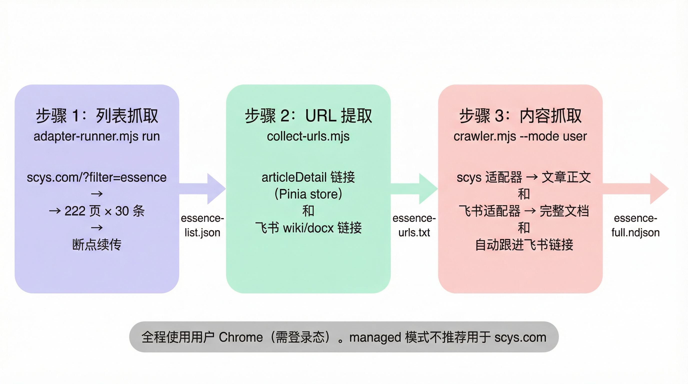

# 生财有术适配器（scys.mjs）

生财有术（scys.com）社区内容提取，覆盖精华帖、帖子详情、风向标、航海项目、航海手册五种页面类型。

**登录要求**：精华帖和风向标等内容需要登录态，必须使用 user mode（直连用户 Chrome），managed mode 的 cookie 移植对微信 OAuth 不可靠。登录墙检测由 `lib/login-detector.mjs` 在 `runAdapter` 层统一处理。

## URL 路由

适配器通过 `detect(url)` 方法根据 URL 路径判断页面类型：

| URL 模式 | pageType | 说明 |
|---|---|---|
| `/?filter=essence` 或首页 | `essence` | 精华帖列表 |
| `/articleDetail/:type/:id` | `article` | 帖子详情 |
| `/opportunity` | `opportunity` | 风向标列表 |
| `/course/detail/:id` | `course` | 航海手册详情 |
| `/activity` | `activity` | 航海项目列表 |

## 页面类型详解

### 精华帖列表（essence）

从 `?filter=essence` 首页提取精华帖卡片列表，支持分页和断点续传。

**数据来源**：DOM 卡片（`.compact-card`）+ Pinia store（`sessionPostStore.postList`）。

关键设计：DOM 中的 `.compact-card` 没有 `<a>` 链接到 `articleDetail` 页面（Vue Router 用 `@click` 跳转），所以从 Pinia store 的 `postList` 数组按索引匹配卡片，用 `entityType + entityId` 构造文章 URL。

提取字段：

| 字段 | 来源 | 说明 |
|------|------|------|
| `title` | `.title-text` | 帖子标题 |
| `author` | `.user-name` | 作者昵称 |
| `identity` | `.vc-identity-badge` | 身份标签（星主、航海家等） |
| `date` | `.time-text` | 发布日期 |
| `preview` | `.content-preview` | 正文摘要 |
| `articleLink` | Pinia `entityType/entityId` | 文章详情 URL（100% 覆盖） |
| `externalLinks` | `<a>` 标签 | 飞书等外部链接 |
| `counts` | `.interactions > *` | 锚点、点赞、评论、收藏 |
| `tags` | `.tags .tag-item` | 标签列表 |

参数说明：

| 参数 | 默认值 | 说明 |
|---|---|---|
| `maxPages` | `5` | 最多翻页数（全量传 999） |
| `limit` | `20` | 最大卡片数 |
| `checkpointFile` | — | 断点续传文件路径，每页原子写入 |
| `resumePage` | `false` | 从断点继续（跳页后校验 active 页码） |

### 帖子详情（article）

从 `/articleDetail/xq_topic/{id}` 页面提取完整文章内容。

**DOM 选择器**（2025 版）：

```
.content-mt > .container > main
  ├── header                → 作者、身份、日期
  ├── .title-line           → 精华标签 + 标题
  ├── .content-container    → ★ 正文（仅此为内容）
  ├── .label-box            → 标签
  ├── .interactions         → 互动数据
  └── .comment-container    → 评论区（已排除）
```

**重要**：正文只取 `.content-container`，不取 `.content-mt`（后者包含评论区）。

**飞书内容自动跟进**：如果正文中包含飞书 wiki/docx 链接，自动打开新 tab 调用 feishu adapter 提取完整内容，合并到 `feishuContent` 字段。仅处理 `/wiki/` 和 `/docx/` 路径，飞书表格（sheets）、多维表格（base）等静默跳过。飞书提取失败不影响主结果。

### 风向标列表（opportunity）

支持两种模式，通过 `ctx.mode` 参数切换：

**预览模式（`mode: 'list'`，默认）**

快速抓取卡片摘要，使用 `scrollToLoad` 滚动加载。

**归档模式（`mode: 'archive'`）**

完整内容提取，支持分页翻页：

1. 如果设置了 `bidOnly`，先点击"中标"tab 切换筛选
2. 逐页提取卡片的完整内容（分页器为 Arco Design 组件）
3. 返回完整的正文、图片、AI 提炼、互动数据

关键发现：风向标的"展开全文"只是 CSS 效果（`max-height` 截断），`innerText` 已包含完整文本，无需交互展开。

| 参数 | 默认值 | 说明 |
|---|---|---|
| `mode` | `'list'` | `'list'` 预览 / `'archive'` 归档 |
| `bidOnly` | `false` | 是否只提取中标风向标 |
| `limit` | `20` | 最大提取数量 |
| `maxPages` | `10` | 归档模式最大翻页数 |

### 航海手册详情（course）

从 `/course/detail/xxx` 页面逐章提取手册内容，输出结构化 Markdown。

提取流程：展开所有折叠 section → 提取目录结构 → 按全局索引逐章点击 → 提取飞书 SDK DOM 的 Markdown 内容。

### 航海项目列表（activity）

从 `/activity` 页面滚动加载 `.vc-navigation-card` 卡片，提取标题、描述、状态、日期范围。辅助方法 `openCourseFromActivity()` 可以点击"查看手册"按钮并返回课程 URL。

## 全量精华帖爬取



```bash
# 第一步：列表抓取（全量，每页写 checkpoint）
node scripts/adapter-runner.mjs run "https://scys.com/?filter=essence" \
  --ctx '{"maxPages":999,"limit":9999,"checkpointFile":"/tmp/essence-cp.json"}' \
  > /tmp/essence-list.json

# 中断后续传
node scripts/adapter-runner.mjs run "https://scys.com/?filter=essence" \
  --ctx '{"maxPages":999,"limit":9999,"checkpointFile":"/tmp/essence-cp.json","resumePage":true}' \
  > /tmp/essence-list.json

# 第二步：提取内容 URL
node scripts/collect-urls.mjs --input /tmp/essence-list.json --output /tmp/essence-urls.txt
# 仅飞书：--filter feishu.cn
# 仅站内：--only-internal

# 第三步：并发爬全文
node scripts/crawler.mjs --urls /tmp/essence-urls.txt --mode user --output /tmp/essence-full.ndjson
```

### 内容类型处理

| 类型 | 特征 | 处理方式 |
|------|------|---------|
| 站内内容 | `articleLink` 有值，正文在 scys.com | `_extractArticle` 提取 `.content-container` |
| 飞书内容 | `externalLinks` 含飞书 URL | 自动跟进飞书 wiki/docx，合并到 `feishuContent` |
| 混合型 | 两者都有 | scys 正文 + 飞书完整内容同时返回 |

## 修改指南

- **新增页面类型**：在 `detect()` 加 URL 匹配规则，在 `extract()` 加 switch case
- **修改 DOM 选择器**：更新对应的 JS 提取代码（`EXTRACT_*_JS` 常量）
- **Pinia store 结构变化**：检查 `sessionPostStore.postList` 的字段名（`entityType`、`entityId`）
- **测试**：
  ```bash
  # 精华帖列表
  node scripts/adapter-runner.mjs run "https://scys.com/?filter=essence" --ctx '{"maxPages":2}'

  # 帖子详情（含飞书跟进）
  node scripts/adapter-runner.mjs run "https://scys.com/articleDetail/xq_topic/14588524581415582"

  # 风向标归档
  node scripts/adapter-runner.mjs run "https://scys.com/opportunity" --ctx '{"mode":"archive","limit":10}'

  # 手册提取
  node scripts/adapter-runner.mjs run "https://scys.com/course/detail/159"
  ```
