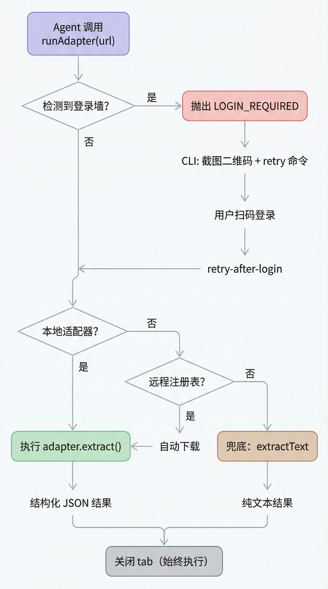

# AnyReach 架构文档

> English version: [architecture.md](architecture.md)

## 设计哲学

AnyReach 源于一个朴素的观察：web-access 项目证明了 **AI Agent 最好的浏览器工具就是用户自己的浏览器**。但它把太多工作留给了 LLM——每访问一个站点，Agent 都需要从零写 JS、探索 DOM 结构、处理虚拟化渲染。Token 在燃烧，结果不稳定。

AnyReach 保留了核心洞察（通过 CDP 连接用户日常 Chrome、共享登录态、在后台 tab 中操作），并在此基础上增加两层：**站点适配器**（可执行的提取代码）和 **提示词**（面向 LLM 的站点知识），辅以**远程注册表**实现按需下载。


### 四层架构

**第一层 — 策略（SKILL.md）**：告诉 Agent *如何思考*网页任务。工具选择矩阵、浏览哲学、失败处理。约 200 行，不含站点特定逻辑。

**第二层 — 基础设施（CDP Proxy）**：通用的 HTTP 浏览器自动化接口。24+ 端点（包括任意 CDP 命令的 `/cdp`、事件收集的 `/events/*`、真实滚动手势的 `/wheel`），零站点特定代码。任何能 `curl` 的 Agent 都能用。

**第三层 — 知识（站点适配器 + 提示词）**：按域名的提取逻辑。代码适配器（`.mjs`）提供确定性提取。提示词（`.md`）为 LLM 引导式探索提供站点模式和坑点。共享工具（`_utils.mjs`）消除重复。

**第四层 — 分发（远程注册表）**：`registry.json` 索引可用适配器。Runner 在首次使用时自动下载缺失的适配器。

### 请求解析流程



## CDP Proxy

Node.js HTTP 服务器，将 `curl` 命令桥接到 Chrome DevTools Protocol（WebSocket）。以 `localhost:3456` 运行，持久化后台进程。

**重要**：Proxy 是长运行进程。修改 `cdp-proxy.mjs` 后需重启：`pkill -f cdp-proxy.mjs && node scripts/check-deps.mjs`。

### 连接流程

```
check-deps.mjs
  ├── 检查 Node.js >= 22
  ├── 发现 Chrome 调试端口
  │     ├── 读取 DevToolsActivePort 文件（macOS/Linux/Windows 路径）
  │     └── 回退：探测端口 9222, 9229, 9333
  └── 启动 cdp-proxy.mjs（后台进程，日志写入 $TMPDIR/anyreach-proxy.log）
        ├── 通过 WebSocket 连接 Chrome
        ├── 监听 localhost:3456
        └── 就绪（健康检查通过）
```

### 反检测

页面可以通过探测 Chrome 调试端口（`fetch('http://127.0.0.1:9222')`）检测自动化。Proxy 通过 `Fetch.requestPaused` 拦截这些请求并返回 `ConnectionRefused`，使调试端口对页面 JavaScript 不可见。

### 端点（24+）

#### Tab 管理

| 端点 | 方法 | 说明 |
|------|------|------|
| `/health` | GET | 连接状态、会话数、Chrome 端口 |
| `/targets` | GET | 列出所有打开的页面 tab |
| `/new?url=` | GET | 创建后台 tab，等待加载完成 |
| `/close?target=` | GET | 关闭 tab |

#### 导航

| 端点 | 方法 | 说明 |
|------|------|------|
| `/navigate?target=&url=` | GET | 导航到 URL |
| `/back?target=` | GET | 后退一页 |
| `/info?target=` | GET | 获取页面标题、URL、readyState |

#### 交互

| 端点 | 方法 | Body | 说明 |
|------|------|------|------|
| `/eval?target=` | POST | JS 表达式 | 执行 JavaScript，支持 async/await |
| `/click?target=` | POST | CSS 选择器 | `el.click()` — 快速，覆盖大多数场景 |
| `/clickAt?target=` | POST | CSS 选择器 | 真实鼠标点击事件，触发文件对话框 |
| `/fill?target=` | POST | `{selector, value}` | 填写表单，触发 React/Vue 响应式 |
| `/scroll?target=&direction=` | GET | — | 滚动页面，等待懒加载 |

#### 内容提取

| 端点 | 方法 | Body | 说明 |
|------|------|------|------|
| `/extractText?target=` | POST | `{selector, scroll}` | 自动滚动 + DOM 文本提取 |
| `/screenshot?target=&file=` | GET | — | 页面截图 |
| `/waitFor?target=&selector=` | GET | — | 等待元素出现（MutationObserver） |

#### Cookie 管理

| 端点 | 方法 | Body | 说明 |
|------|------|------|------|
| `/setCookie?target=` | POST | Cookie JSON | 注入 Cookie（支持 HttpOnly） |
| `/getCookies?target=&domain=` | GET | — | 获取 Cookie |

#### 高级

| 端点 | 方法 | Body | 说明 |
|------|------|------|------|
| `/preScript?target=` | POST | JS 代码 | 页面 JS 执行前注入脚本 |
| `/adapter?url=` | POST | — | 调用站点适配器。返回结构化内容、401 `login_required` 或 404 `no_adapter` |
| `/cdp?target=` | POST | `{method, params}` | 发送任意 CDP 命令 |

## 站点适配器系统

### 代码适配器（.mjs）

每个适配器导出一个默认对象：

```javascript
import { sleep, scrollToLoad, downloadMedia } from './_utils.mjs';

export default {
  name: 'example',
  domains: ['example.com'],
  description: '...',
  detect(url) { ... },                        // 分类页面类型
  async extract(proxy, targetId, ctx) { ... }, // 提取内容
};
```

### 提示词（.md）

适用于维护成本高于收益的站点：

```markdown
---
domain: example.com
aliases: [ex, Example]
---
## 平台特征 ...
## 有效模式 ...
## 已知坑点 ...
```

### 共享工具（_utils.mjs）

| 函数 | 说明 |
|------|------|
| `sleep(ms)` | Promise 延迟 |
| `downloadFile(url, path)` | 下载 URL 到本地文件 |
| `downloadMedia(obj, dir)` | 批量下载图片 + 视频 |
| `scrollToLoad(proxy, targetId, opts)` | 滚动加载 + 卡片提取轮询 |

### ProxyClient

适配器接收一个 `ProxyClient` 实例，封装 CDP Proxy HTTP 调用：

```
proxy.newTab(url)              → targetId
proxy.close(targetId)
proxy.eval(targetId, js)       → value
proxy.click(targetId, selector)
proxy.clickAt(targetId, selector)
proxy.scroll(targetId, opts)
proxy.screenshot(targetId, path)
proxy.extractText(targetId, opts)
proxy.fill(targetId, fields)
proxy.waitFor(targetId, sel, ms)
proxy.navigate(targetId, url)
proxy.info(targetId)           → { title, url, ready }
proxy.setCookie(targetId, cookie)
proxy.getCookies(targetId, domain)
proxy.preScript(targetId, js)
```

### Adapter Runner

CLI 工具和可导入模块：

```bash
node scripts/adapter-runner.mjs list                          # 列出本地适配器
node scripts/adapter-runner.mjs check <url>                   # 检查匹配层级
node scripts/adapter-runner.mjs run <url> [--ctx <json>]      # 运行适配器
node scripts/adapter-runner.mjs hint <url>                    # 获取提示词
node scripts/adapter-runner.mjs download <url>                # 预下载远程适配器
node scripts/adapter-runner.mjs retry-after-login <id> <url>  # 登录后重试
```

`--ctx` 参数传递适配器配置：

| 参数 | 说明 | 默认 |
|------|------|------|
| `limit` | 最大条目数 | 20 |
| `maxPages` | 最多翻页数 | 5 |
| `checkpointFile` | 断点续传文件路径 | — |
| `resumePage` | 从断点继续 | false |

### 登录墙检测

`runAdapter()` 自动检测登录墙（二维码 / 账密 / 未知类型），全站点通用。

- 检测到登录墙时 throw `LOGIN_REQUIRED` error（tab 总是关闭，无泄漏）
- CLI `run` 命令截获后：截图二维码、保留 tab、输出 retry 命令
- 批量场景（crawler）：记录 error，不重试

### 远程注册表

`registry.json` 索引可用适配器。`adapter-runner` 找不到本地匹配时，从 GitHub 获取注册表，下载适配器文件 + 共享依赖到 `adapters/`。后续调用使用本地副本。

### 已安装适配器

| 适配器 | 域名 | 能力 |
|--------|------|------|
| **feishu** | feishu.cn, larksuite.com | Wiki/docx 全文提取（`window.DATA` block 数据 + Worker CDP 拦截）。Markdown 输出 |
| **xiaohongshu** | xiaohongshu.com | 图文/视频笔记、个人主页、feed 流 |
| **x** | x.com, twitter.com | 时间线、搜索、个人主页、列表、推文详情、长文章。GraphQL 分页、视频 HLS 恢复 |
| **scys** | scys.com | 精华帖列表、帖子详情（自动跟进飞书）、风向标、航海项目、航海手册 |

## 生财有术全量精华帖爬取


### 三步流水线

```bash
# 第一步：列表抓取（全量约 222 页，每页写 checkpoint）
node scripts/adapter-runner.mjs run "https://scys.com/?filter=essence" \
  --ctx '{"maxPages":999,"limit":9999,"checkpointFile":"/tmp/essence-cp.json"}'

# 第二步：提取内容 URL（从 Pinia store 获取 articleLink + 飞书链接）
node scripts/collect-urls.mjs --input result.json --output urls.txt

# 第三步：并发爬全文（user mode 保持登录态）
node scripts/crawler.mjs --urls urls.txt --mode user --output full.ndjson
```

### 精华帖内容类型

| 类型 | 说明 | 处理方式 |
|------|------|---------|
| 站内内容 | 正文直接在 scys.com | `_extractArticle` 提取 `.content-container`（排除评论） |
| 飞书内容 | 正文在飞书 wiki/docx | 自动跟进：检测到飞书链接时打开新 tab、调用 feishu adapter |
| 混合型 | scys 有摘要 + 飞书有完整内容 | 两者都提取，合并到 `feishuContent` 字段 |

## 未来规划

### 多 Agent 会话管理

当前模型：每个 Agent/子 Agent 管理自己的 targetId。适用于单 Agent + 子 Agent 场景。当多个独立 Agent 框架共享一个 Proxy 时会有 orphan tab 和冲突风险。

计划：轻量级 `/session/create` + `/session/close` 层。每个 Agent 框架获得一个 session，tab 关联到 session，一次调用清理所有 orphan tab。完全向后兼容。

尚未实现，等多 Agent 使用成为现实时再建。
