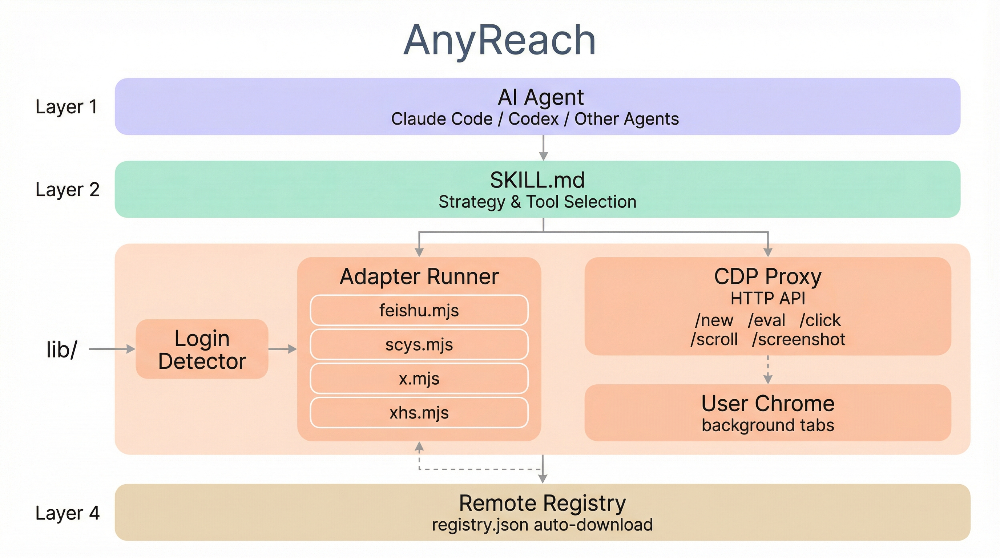
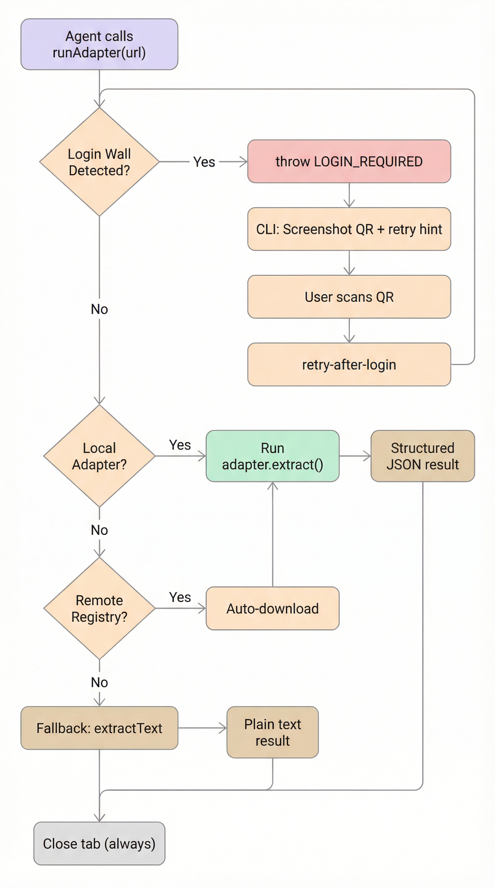
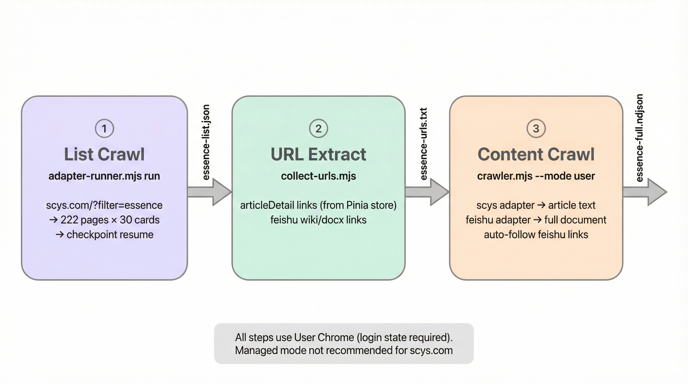

# AnyReach Architecture

> Chinese version: [architecture-zh.md](architecture-zh.md)

## Design Philosophy

web-access proved that **the best browser tool for AI agents is the user's own browser**. But it left too much to the LLM — every site visit requires writing custom JS, exploring DOM, handling virtualized rendering from scratch.

AnyReach keeps the core insight (CDP connection to user's daily Chrome, shared login state, background tabs) and adds: **site adapters** (executable extraction code), **prompt hints** (site-specific LLM knowledge), a **remote registry** (on-demand download), and a **batch crawler** (concurrent multi-URL extraction).

## System Overview



### Four layers

| Layer | Component | Role |
|-------|-----------|------|
| Strategy | SKILL.md | Teaches the agent *how to think* about web tasks. Tool selection, browsing philosophy, failure handling. No site-specific logic. |
| Infrastructure | CDP Proxy | Generic browser automation over HTTP. 24+ endpoints, zero site-specific code. Any agent that can `curl` can use it. |
| Knowledge | Adapters + Hints | Per-domain extraction. Code adapters (`.mjs`) for deterministic extraction. Prompt hints (`.md`) for LLM-guided exploration. |
| Distribution | Remote Registry | `registry.json` indexes available adapters. Runner auto-downloads on first use. |

### Request flow



Resolution order: local adapter → local hint → remote registry (auto-download) → generic CDP mode. Login wall detection runs before adapter execution. Tab always closes in `finally`.

## File Structure

```
scripts/
  cdp-proxy.mjs           HTTP server bridging curl → Chrome DevTools Protocol
  adapter-runner.mjs       Adapter dispatch: match URL → run adapter → return JSON
  crawler.mjs              Batch URL extraction with concurrency, retry, NDJSON output
  collect-urls.mjs         Extract content URLs from list crawl results
  check-deps.mjs           Environment check + proxy auto-start
  install.mjs              Skill symlink installer

lib/
  proxy-client.mjs         ProxyClient class (shared HTTP client for CDP Proxy)
  login-detector.mjs       Universal login wall detection (QR/form/unknown)
  browser-provider.mjs     Browser instance factory (user mode / managed mode)

adapters/
  feishu.mjs               See adapter-feishu.md
  scys.mjs                 See adapter-scys.md
  x.mjs                    See adapter-x.md
  xiaohongshu.mjs
  _utils.mjs               Shared: sleep, scrollToLoad, downloadMedia
  _template.mjs            Starter template for new adapters
```

## CDP Proxy

Node.js HTTP server on `localhost:3456`. Persistent detached process — restart after code changes with `pkill -f cdp-proxy.mjs && node scripts/check-deps.mjs`.

### Connection

```
check-deps.mjs
  ├── Check Node.js >= 22
  ├── Discover Chrome debug port
  │     ├── Read DevToolsActivePort file (macOS/Linux/Windows paths)
  │     └── Fallback: probe ports 9222, 9229, 9333
  └── Start cdp-proxy.mjs (detached)
        ├── Connect to Chrome via WebSocket
        ├── Listen on localhost:3456
        └── Ready
```

### Anti-detection

Pages can detect automation by probing the debug port (`fetch('http://127.0.0.1:9222')`). The proxy intercepts via `Fetch.requestPaused` and returns `ConnectionRefused`.

### Session model

Each tab is identified by `targetId`. The proxy maintains `targetId → sessionId` mapping via `Target.attachToTarget`. Sessions are created lazily and cleaned up on close. Multiple agents share one proxy — each uses its own targetIds, no contention.

### Endpoint reference

#### Tab management

| Endpoint | Method | Description |
|----------|--------|-------------|
| `/health` | GET | Connection status, session count |
| `/targets` | GET | List all page tabs |
| `/new?url=` | GET | Create background tab, returns `{ targetId }` |
| `/close?target=` | GET | Close tab |

#### Navigation & interaction

| Endpoint | Method | Body | Description |
|----------|--------|------|-------------|
| `/navigate?target=&url=` | GET | — | Navigate to URL |
| `/back?target=` | GET | — | Go back |
| `/info?target=` | GET | — | Title, URL, readyState |
| `/eval?target=` | POST | JS | Execute JavaScript (async supported) |
| `/click?target=` | POST | CSS selector | `el.click()` |
| `/clickAt?target=` | POST | CSS selector | Real mouse event via CDP |
| `/fill?target=` | POST | `{selector, value}` | Fill form, triggers React/Vue reactivity |
| `/scroll?target=&direction=` | GET | — | Scroll page, waits for lazy-load |
| `/wheel?target=&deltaY=` | GET | — | Real scroll gesture for virtual lists |

#### Content extraction

| Endpoint | Method | Body | Description |
|----------|--------|------|-------------|
| `/extractText?target=` | POST | `{selector, scroll}` | Auto-scroll + DOM text extraction |
| `/screenshot?target=&file=` | GET | — | Page screenshot |
| `/waitFor?target=&selector=` | GET | — | MutationObserver wait, 408 on timeout |

#### Cookie, scripting, CDP pass-through

| Endpoint | Method | Body | Description |
|----------|--------|------|-------------|
| `/setCookie?target=` | POST | Cookie JSON | Inject cookie (supports HttpOnly) |
| `/getCookies?target=&domain=` | GET | — | Get cookies |
| `/preScript?target=` | POST | JS | Inject script before page JS |
| `/cdp?target=` | POST | `{method, params}` | Arbitrary CDP command |
| `/adapter?url=` | POST | — | Run adapter. Returns content, 401 `login_required`, or 404 `no_adapter` |
| `/events/start?target=` | POST | `{filter, maxEvents}` | Start CDP event collection |
| `/events/get?id=` | GET | — | Get collected events |
| `/events/stop?id=` | GET | — | Stop collector |

## Site Adapter System

### Adapter interface

```javascript
export default {
  name: 'example',
  domains: ['example.com'],
  detect(url) { ... },                        // → page type string
  async extract(proxy, targetId, ctx) { ... }, // → structured result
};
```

`proxy` is a `ProxyClient` instance (`lib/proxy-client.mjs`) wrapping all CDP Proxy HTTP calls. `ctx` contains `{ url, pageType, ...opts }` — callers pass extra params (limit, maxPages, checkpointFile, etc.) via opts.

### Prompt hints (.md)

For sites where a code adapter isn't worth the maintenance:

```markdown
---
domain: example.com
aliases: [ex]
---
## Effective patterns ...
## Known pitfalls ...
```

### Adapter Runner

CLI and importable module. Core function: `runAdapter(url, opts)` → structured JSON.

```bash
node scripts/adapter-runner.mjs list                          # List adapters
node scripts/adapter-runner.mjs run <url> [--ctx <json>]      # Run adapter
node scripts/adapter-runner.mjs retry-after-login <id> <url>  # Retry after login
node scripts/adapter-runner.mjs check <url>                   # Check match level
node scripts/adapter-runner.mjs hint <url>                    # Get hint content
```

`--ctx` passes adapter parameters: `limit`, `maxPages`, `mode`, `bidOnly`, `checkpointFile`, `resumePage`.

### Remote registry

`registry.json` indexes available adapters. When no local match is found, the runner fetches the registry from GitHub, downloads adapter files + shared dependencies. Subsequent calls use local copies.

### Installed adapters

| Adapter | Domains | Details |
|---------|---------|---------|
| feishu | feishu.cn, larksuite.com | [adapter-feishu.md](adapter-feishu.md) |
| scys | scys.com | [adapter-scys.md](adapter-scys.md) |
| x | x.com, twitter.com | [adapter-x.md](adapter-x.md) |
| xiaohongshu | xiaohongshu.com, xhslink.com | Notes, profiles, feeds |

## Login Wall Detection

`lib/login-detector.mjs` provides universal login wall detection across all sites.

**Detection logic**: Check for content selectors first (already logged in → return null). Then scan modal/dialog/overlay containers for login text patterns. Only fall back to full-page text scan when body content is very short (< 200 chars). This avoids false positives from article text mentioning "请登录".

**Three functions**:
- `detect(proxy, targetId)` → `null | { type: 'qr' | 'form' | 'unknown' }`
- `capture(proxy, targetId)` → `{ type, screenshotPath?, fields?, message }`
- `waitForLogin(proxy, targetId, opts)` → polls until login wall disappears (3min timeout)

**Integration with runAdapter**: Login detection runs after page load, before adapter execution. If detected, throws `LOGIN_REQUIRED` error (tab always closes in `finally` — no leak). CLI `run` command catches this, screenshots the QR, opens a new tab, and outputs a `retry-after-login` command with original `--ctx` preserved.

**Batch behavior**: `crawler.mjs` catches `LOGIN_REQUIRED` as a non-retryable error, records `status: 'error'`, moves on.

## Batch Crawling

### Design principle

The crawler is a **pure executor** — it doesn't decide *what* to crawl. All crawl strategy (which URLs, how many pages, what concurrency) comes from the agent or the user. The crawler manages concurrency, retry, timeout, and NDJSON output.

### Dual browser mode

| Mode | When | How |
|------|------|-----|
| **User** (`--mode user`) | Sites requiring login (scys.com, etc.) | Attaches to user's daily Chrome via existing CDP Proxy. Natural login state. |
| **Managed** (`--mode managed`, default) | Public data, batch jobs | Spawns isolated headless Chrome + CDP Proxy. Clean environment, concurrent-safe. |

`lib/browser-provider.mjs` provides `createBrowser(opts)` returning `{ proxyBase, proxyPort, close() }`. Both modes expose the same interface — the caller doesn't know which mode is running.

**Managed mode limitation**: Chrome binary discovery is currently macOS-only. Linux/Windows will error with a clear message.

### Cookie transplant (managed mode)

Managed Chrome has no login state. Cookie transplant bridges this:

```
Start managed Chrome + CDP Proxy
  → Open temp tab on user Chrome → Network.getAllCookies() → close tab
  → Open temp tab on managed Chrome → Network.setCookie() per cookie → close tab
  → Ready to crawl with user's login state
```

`--copy-cookies auto` (default): copies if user Chrome is available, skips otherwise. `true`: forces copy, errors if unavailable. `false`: clean environment.

Cookie is a startup snapshot — crawler operations never affect user Chrome's login state.

### Concurrency & timeout

`--concurrency N` controls parallel workers (simultaneous URLs), not tab count. A single adapter may open sub-tabs internally.

`--timeout` is **scheduling-level** — it unblocks the worker but does not cancel `runAdapter()`. The adapter's `finally` block eventually closes its tab. Managed Chrome shutdown is the final cleanup. Execution-level cancel via AbortSignal is planned for V2.

### Result validation

The crawler checks `result.error` on resolved adapter results. Adapters that return `{ error: 'login_required' }` from inside `extract()` are recorded as errors, not successes.

### Usage

```bash
node scripts/crawler.mjs --urls urls.txt \
  [--concurrency 3] [--delay 1000] [--timeout 30000] [--retry 2] \
  [--mode managed] [--copy-cookies auto] [--output results.ndjson]
```

Output: NDJSON, each line `{ url, status, adapter, timestamp, duration_ms, data|error }`. Progress/logs to stderr.

## List Crawl Pipeline

For sites with paginated lists (e.g., scys.com essence posts), a three-step pipeline connects list extraction → URL collection → content crawling.



```bash
# Step 1: List crawl (paginated, with checkpoint)
node scripts/adapter-runner.mjs run "https://scys.com/?filter=essence" \
  --ctx '{"maxPages":999,"limit":9999,"checkpointFile":"/tmp/cp.json"}'

# Step 2: Extract content URLs (articleDetail + feishu links)
node scripts/collect-urls.mjs --input result.json --output urls.txt
# --only-internal | --only-external | --filter feishu.cn

# Step 3: Batch content extraction
node scripts/crawler.mjs --urls urls.txt --mode user --output full.ndjson
```

`collect-urls.mjs` reads JSON or NDJSON from a list crawl, extracts `articleLink` and `externalLinks` (feishu, etc.), deduplicates, and outputs a URL list file.

## SKILL.md Design

The agent-facing prompt teaches thinking strategy, not procedures:

1. **Browsing philosophy** — four-step loop: define success → choose entry → validate → confirm
2. **Tool selection** — when to use WebSearch / Jina / curl / CDP
3. **CDP Proxy API** — endpoint reference for constructing curl commands
4. **Site knowledge** — four-tier resolution: adapter → hint → remote → generic
5. **Login flow** — LOGIN_REQUIRED error structure, QR screenshot, retry-after-login
6. **Batch crawling** — crawler params, collect-urls, pipeline recipe
7. **Site-specific** — scys.com page types, content types, full crawl pipeline

What's NOT in SKILL.md: adapter internals, DOM selectors, step-by-step implementation details.

## Key Design Decisions

| Decision | Rationale |
|----------|-----------|
| **CDP Proxy over Playwright** | Direct Chrome connection preserves login state, avoids detection, supports parallel background tabs |
| **Adapter pattern** | Site-specific code is executable knowledge. When an adapter exists, skip LLM-driven DOM exploration entirely |
| **window.DATA for Feishu** | DOM/innerText/Selection API all fail due to canvas-level virtualized rendering. `window.DATA.clientVars.data.block_map` is the only reliable path |
| **Pinia store for scys articleLink** | DOM cards have no `<a>` to articleDetail (Vue Router @click). `sessionPostStore.postList` provides entityType + entityId for URL construction |
| **throw LOGIN_REQUIRED (not return)** | Ensures tab always closes in `finally`. CLI catches and handles interactively. Batch callers get clean errors without orphan tabs |
| **Login detection scoped to modal/dialog** | Full-page text scan causes false positives when articles mention "请登录". Scanning only modal containers + short-page fallback fixes this |
| **Scheduling-level timeout** | `runAdapter` has no AbortSignal support yet. Timer unblocks the worker, adapter's `finally` eventually cleans up. Managed Chrome shutdown is the backstop |
| **Atomic checkpoint writes** | Write to `.tmp` then `renameSync`. Process crash during write won't corrupt the checkpoint file |

## Known Limitations

- **Managed mode: macOS only** — `findChromeBinary()` only searches macOS paths. Linux/Windows will error with a clear message.
- **Timeout is scheduling-level** — `runAdapter` cannot be cancelled mid-execution. Adapter's `finally` eventually cleans up, but a timed-out adapter may briefly overlap with the next retry.
- **Cookie transplant scope** — Covers HTTP cookies (~95% of sites). localStorage/indexedDB transplant is not implemented. Some OAuth flows (WeChat) may not survive transplant — use user mode instead.
- **No URL deduplication in crawler** — Planned for V2. Currently relies on input URL list being pre-deduplicated.

## Future Work

| Item | Priority | Description |
|------|----------|-------------|
| AbortSignal support | V2 | Execution-level cancel for runAdapter + ProxyClient fetch calls |
| Crawler state file | V2 | Checkpoint/resume for batch crawls (currently only list adapters have this) |
| URL dedup + filtering | V2 | `--dedupe-by url`, `--include-pattern`, `--exclude-pattern` |
| Chrome process restart | V2 | `--restart-after N` to prevent memory leaks on long crawls |
| Multi-agent sessions | V3 | `/session/create` + `/session/close` for orphan tab cleanup across agent frameworks |
| Agent-driven crawl plans | V3 | Structured plan generation from natural language, multi-phase discover → extract |
