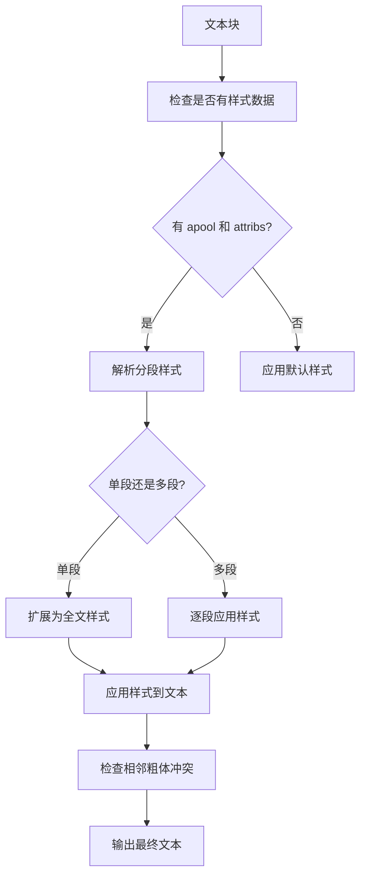
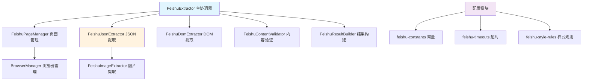

# 飞书文档解析算法技术详解

> **版本**: v2.0.1  
> **更新时间**: 2025-01-17  
> **维护者**: Link2Text 开发团队  
> **架构**: 模块化设计

## 📋 概述

飞书（Feishu/Lark）作为企业级协作文档平台，其文档数据结构极其复杂。本文档详细记录了我们对飞书文档解析的深度技术分析，包括数据结构解密、样式处理算法、模块化架构设计以及实现细节。

### 🏗️ v2.0.1 模块化架构

Link2Text v2.0.1 采用模块化架构设计，将飞书解析功能拆分为多个专门模块：

```
services/content-extractor/feishu/
├── FeishuJsonExtractor.ts    # 核心JSON解析器 (519行)
├── FeishuPageManager.ts      # 页面管理器 (130行)  
├── FeishuDomExtractor.ts     # DOM后备提取器 (68行)
├── FeishuImageExtractor.ts   # 图片处理器 (83行)
├── FeishuContentValidator.ts # 内容验证器 (59行)
├── FeishuResultBuilder.ts    # 结果构建器 (59行)
└── interfaces.ts             # 类型定义 (75行)
```

**架构优势**：
- 🎯 **单一职责**: 每个模块专注一个功能
- 🔧 **易于测试**: 模块独立，便于单元测试
- 📈 **可扩展性**: 新功能可独立模块形式添加
- 🛡️ **错误隔离**: 模块间错误不相互影响

### 🎯 解析目标

- **文本内容提取**: 保持原有格式和结构
- **样式处理**: 粗体、斜体、删除线、颜色高亮等
- **图片处理**: 内嵌图片、画板、文件预览
- **块级元素**: 标题、引用、列表等
- **分段样式**: 处理飞书独特的分段样式系统

---

## 🏗️ 飞书文档数据结构分析

### 1. 全局数据结构

飞书文档在浏览器中通过 `window.DATA` 全局对象暴露文档数据：

```typescript
interface FeishuGlobalData {
  clientVars: {
    data: {
      block_map: Record<string, BlockData>;
      block_sequence: string[];
      apool?: ApoolData;  // 全局样式池（可能不存在）
    }
  }
}
```

**关键特性**：
- `block_map`: 所有文档块的映射表，以块ID为key
- `block_sequence`: 文档块的渲染顺序数组
- `apool`: 全局样式定义池（经常为空，需要从block级别获取）

### 2. 块（Block）数据结构

每个块代表文档中的一个元素（段落、标题、图片等）：

```typescript
interface BlockData {
  data: {
    type: string;           // 'text', 'heading_1', 'image', 'file', 'whiteboard'
    seq?: number;           // 序号（用于有序列表）
    text?: TextData;        // 文本内容和样式
    image?: ImageData;      // 图片数据
    file?: FileData;        // 文件数据
    token?: string;         // 画板token
    children?: string[];    // 子块ID数组
  }
}
```

### 3. 文本数据结构

这是飞书最复杂的部分，包含内容和样式信息：

```typescript
interface TextData {
  initialAttributedTexts: {
    text: Record<string, string>;    // 文本片段
    attribs: Record<string, string>; // 样式属性字符串
    author?: any;                    // 作者信息
    charBank?: any;                  // 字符库
  };
  apool?: ApoolData;                 // 块级样式池
}
```

**重要发现**：
1. `text` 对象包含多个键值对，值为字符串片段
2. `attribs` 对象的键对应 `text` 的键，值为样式描述字符串
3. 样式信息通常在**块级别的 `apool`** 中，而非全局

---

## 🎨 飞书样式系统深度解析

### 1. Apool（样式池）结构

```typescript
interface ApoolData {
  nextNum: number;
  numToAttrib: Record<string, [string, string]>;
}
```

**典型示例**：
```json
{
  "nextNum": 3,
  "numToAttrib": {
    "0": ["author", "7232316383562858500"],
    "1": ["bold", "true"],
    "2": ["textHighlight", "rgb(36,91,219)"]
  }
}
```

**样式编号规则**：
- `0`: 通常为作者或默认样式
- `1`: 常见的格式样式（粗体、斜体等）
- `2+`: 颜色、高亮等扩展样式

### 2. Attribs 字符串格式解析

Attribs 是飞书样式系统的核心，格式复杂且具有特定规律：

#### 2.1 基本格式模式

```
"*样式编号+长度*样式编号+长度..."
```

**示例分析**：

| Attribs 字符串 | 含义 | 解析结果 |
|---------------|------|----------|
| `"*0+6*0*1*2+5*0+1m"` | 前6字符样式0，接下来5字符样式0+1+2，剩余字符样式0 | 分段样式 |
| `"*0*1*2+17"` | 前17字符应用样式0+1+2 | 单段样式+剩余普通 |
| `"*0*1+5"` | 前5字符应用样式0+1 | 简单样式 |

#### 2.2 长度编码规则

飞书使用混合进制系统表示长度：

```typescript
function parseHexLength(lengthStr: string): number {
  // 特殊标记：字母结尾表示"剩余所有字符"
  if (/\d+[a-z]+$/.test(lengthStr)) {
    return -1; // 返回-1表示剩余所有字符
  }
  
  // 纯数字：十进制
  if (/^\d+$/.test(lengthStr)) {
    return parseInt(lengthStr, 10);
  }
  
  // 字母：36进制 (a=10, b=11, ..., z=35)
  const hexValue = parseInt(lengthStr, 36);
  return isNaN(hexValue) ? 0 : hexValue;
}
```

**关键发现**：
- `1m`, `2m` 等以字母结尾的表示"剩余所有字符"
- 纯数字表示确切的字符数量
- 单个字母使用36进制 (`a`=10, `b`=11, 等)

#### 2.3 样式引用解析

```typescript
function parseFeishuSegments(attribStr: string): Array<{styles: string[], length: string}> {
  const segments = [];
  const segmentPattern = /(\*[\d\*]*)\+([a-z0-9]+)/g;
  let match;
  
  while ((match = segmentPattern.exec(attribStr)) !== null) {
    const styleRefs = match[1]; // *0*1*2
    const length = match[2];    // 6, 5, 1m等
    
    // 解析样式引用：*0*1*2 → ['*0', '*1', '*2']
    const styles = styleRefs.split('*').filter(s => s !== '').map(s => `*${s}`);
    
    segments.push({ styles, length });
  }
  
  return segments;
}
```

---

## 🔧 样式处理算法详解

### 1. 处理流程概览



### 2. 核心算法实现 (v2.0.1 模块化架构)

#### 2.0 模块化提取流程

```typescript
// 主协调器 - FeishuExtractor.ts (136行)
class FeishuExtractor {
  private pageManager: FeishuPageManager;
  private jsonExtractor: FeishuJsonExtractor;
  private domExtractor: FeishuDomExtractor;
  private validator: FeishuContentValidator;
  private resultBuilder: FeishuResultBuilder;

  async extract(url: string): Promise<ExtractResult> {
    // 1. 页面准备 (FeishuPageManager)
    const page = await this.preparePage(url);
    
    // 2. 内容提取 (优先JSON，DOM作为后备)
    const feishuContent = await this.extractContent(page);
    
    // 3. 验证和构建结果
    this.validator.validate(feishuContent);
    return this.resultBuilder.buildSuccessResult(url, feishuContent, contentId, extractTime);
  }

  private async extractContent(page: Page): Promise<FeishuContent> {
    // 优先JSON提取 (FeishuJsonExtractor)
    const jsonResult = await this.jsonExtractor.extract(page);
    if (jsonResult.success && jsonResult.content) {
      return this.buildContentFromJson(jsonResult, pageInfo.title);
    }

    // 回退到DOM提取 (FeishuDomExtractor)
    return this.domExtractor.extract(page, pageInfo);
  }
}
```

#### 2.1 JSON提取器核心算法 (FeishuJsonExtractor - 519行)

```typescript
class FeishuJsonExtractor {
  private imageExtractor: FeishuImageExtractor;

  async extract(page: Page): Promise<ExtractResult> {
    return await page.evaluate((styleRules) => {
      // 获取飞书内部数据
      const data = (window as any).DATA;
      if (!data?.document?.blocks) {
        return { success: false, error: 'No document data found' };
      }

      // 解析文档块
      const blocks = data.document.blocks;
      let content = '';
      const images: any[] = [];

      // 遍历处理每个块
      for (const [blockId, block] of Object.entries(blocks)) {
        const result = this.processBlock(block, blockId, styleRules);
        content += result.content;
        images.push(...result.images);
      }

      return { success: true, content, images };
    }, FEISHU_STYLE_RULES);
  }

  private processBlock(block: any, blockId: string, styleRules: any): BlockResult {
    // 根据块类型分发处理
    switch (block.type) {
      case 'text':
      case 'paragraph':
        return this.processTextBlock(block, styleRules);
      case 'image':
        return this.processImageBlock(block, blockId);
      case 'heading':
        return this.processHeadingBlock(block, styleRules);
      // ... 其他块类型
      default:
        return { content: '', images: [] };
    }
  }
}
```

#### 2.2 样式数据解析算法

```typescript
function parseStyleData(initialAttributedTexts: any, blockApool?: any, isTargetText: boolean = false) {
  const result = {
    apool: null as any,
    attribStr: '',
    segments: [] as Array<{styles: string[], length: string}>,
    globalStyles: [] as any[],
    hasSegmentedStyles: false,
    hasGlobalStyles: false
  };
  
  // 优先使用块级apool
  if (blockApool && blockApool.numToAttrib) {
    result.apool = blockApool.numToAttrib;
  } else if (initialAttributedTexts.apool && initialAttributedTexts.apool.numToAttrib) {
    result.apool = initialAttributedTexts.apool.numToAttrib;
  }
  
  // 获取attribs字符串
  if (initialAttributedTexts.attribs && initialAttributedTexts.attribs['0']) {
    result.attribStr = initialAttributedTexts.attribs['0'];
  }
  
  // 解析分段样式
  if (result.apool && result.attribStr) {
    result.segments = parseFeishuSegments(result.attribStr);
    result.hasSegmentedStyles = result.segments.length > 0;
    
    // 关键修复：处理单段落场景
    if (result.segments.length === 1) {
      const lastSegment = result.segments[0];
      const lastLength = lastSegment.length;
      
      // 如果不是"剩余字符"格式，扩展为全文
      if (!/[a-z]+$/.test(lastLength)) {
        result.segments[0].length = '1m';
      }
    }
  }
  
  return result;
}
```

#### 2.2 分段样式应用

```typescript
function applySegmentedStyles(text: string, styleData: any, isTargetText: boolean = false): string {
  let processedText = '';
  let currentPosition = 0;
  
  for (let i = 0; i < styleData.segments.length; i++) {
    const segment = styleData.segments[i];
    const segmentLength = parseHexLength(segment.length);
    
    // 计算结束位置
    let endPosition: number;
    if (segmentLength === -1) {
      endPosition = text.length; // 剩余所有字符
    } else {
      endPosition = Math.min(currentPosition + segmentLength, text.length);
    }
    
    const segmentText = text.slice(currentPosition, endPosition);
    let styledSegmentText = segmentText;
    
    // 应用样式
    for (const styleRef of segment.styles) {
      const styleNum = styleRef.replace('*', '');
      if (styleData.apool && styleData.apool[styleNum]) {
        const style = styleData.apool[styleNum];
        if (Array.isArray(style) && style.length >= 2) {
          const [styleType, styleValue] = style;
          styledSegmentText = applyStyle(styledSegmentText, styleType, styleValue);
        }
      }
    }
    
    // 关键修复：处理相邻粗体冲突
    if (i > 0 && processedText.endsWith('**') && styledSegmentText.startsWith('**')) {
      processedText += ' '; // 添加空格避免 ****
    }
    
    processedText += styledSegmentText;
    currentPosition = endPosition;
  }
  
  return processedText;
}
```

#### 2.3 单个样式应用

```typescript
function applyStyle(text: string, styleType: string, styleValue: string): string {
  switch (styleType) {
    case 'bold':
      return styleValue === 'true' ? `**${text}**` : text;
      
    case 'italic':
      return styleValue === 'true' ? `*${text}*` : text;
      
    case 'strikethrough':
      return styleValue === 'true' ? `~~${text}~~` : text;
      
    case 'color':
    case 'textHighlight':
      // 颜色样式暂时跳过，未来可以扩展
      return text;
      
    default:
      return text;
  }
}
```

---

## 🎨 颜色样式系统分析

### 1. 颜色数据格式

根据已观察到的数据，飞书颜色系统包含：

**样式类型**：
- `color`: 文字颜色
- `textHighlight`: 背景高亮颜色

**颜色值格式**：
```json
{
  "2": ["textHighlight", "rgb(36,91,219)"],
  "3": ["color", "#ff0000"],
  "4": ["textHighlight", "rgb(46,161,33)"]
}
```

### 2. 常见颜色映射

| 飞书颜色值 | 用途 | HTML/CSS等效 |
|-----------|------|-------------|
| `rgb(36,91,219)` | 蓝色高亮 | `#245bdb` |
| `rgb(46,161,33)` | 绿色高亮 | `#2ea121` |
| `rgb(255,0,0)` | 红色文字 | `#ff0000` |

### 3. 颜色处理算法（待实现）

```typescript
function applyColorStyle(text: string, styleType: string, styleValue: string): string {
  if (styleType === 'textHighlight') {
    // 背景高亮
    return `<mark style="background-color: ${styleValue}">${text}</mark>`;
  } else if (styleType === 'color') {
    // 文字颜色
    return `<span style="color: ${styleValue}">${text}</span>`;
  }
  return text;
}
```

---

## 📊 图片和媒体处理

### 1. 图片块结构

```typescript
interface ImageData {
  token: string;           // 图片token，用于构建URL
  name: string;           // 图片名称
  width: number;          // 宽度
  height: number;         // 高度
  mimeType: string;       // MIME类型
  caption?: {             // 图片标题
    text: {
      initialAttributedTexts: {
        text: string;
      }
    }
  }
}
```

### 2. URL构建规则

**文档内图片**：
```typescript
const imageUrl = `https://internal-api-drive-stream.feishu.cn/space/api/box/stream/download/v2/cover/${imageToken}/?fallback_source=1&height=1280&mount_node_token=${blockId}&mount_point=docx_image&policy=equal&width=1280`;
```

**画板预览**：
```typescript
const whiteboardImageUrl = `https://internal-api-drive-stream.feishu.cn/space/api/box/stream/download/preview/${whiteboardToken}/?preview_type=16`;
```

**视频文件**：
```typescript
const videoUrl = `https://internal-api-drive-stream.feishu.cn/space/api/box/stream/download/video/${fileToken}/?quality=720p&mount_point=docx_file`;
```

---

## 🐛 常见问题和解决方案

### 1. 相邻粗体样式冲突

**问题**: `**text1****text2**` 导致Markdown渲染错误
```
❌ **做AI编程****时代到来了**
✅ **做AI编程** **时代到来了**
```

**解决方案**: 在相邻粗体片段间添加空格
```typescript
if (i > 0 && processedText.endsWith('**') && styledSegmentText.startsWith('**')) {
  processedText += ' ';
}
```

### 2. 单段落样式扩展

**问题**: `*0*1*2+17` 被错误解析为两段
```
❌ 前17字符粗体 + 剩余字符普通
✅ 整段文字都是粗体
```

**解决方案**: 检测单段落情况并扩展长度
```typescript
if (segments.length === 1 && !/[a-z]+$/.test(lastLength)) {
  segments[0].length = '1m';
}
```

### 3. 长度解析错误

**问题**: `1m` 被解析为1个字符而不是剩余字符
```
❌ parseHexLength("1m") = 1
✅ parseHexLength("1m") = -1 (剩余所有)
```

**解决方案**: 特殊处理字母结尾的长度标记
```typescript
if (/\d+[a-z]+$/.test(lengthStr)) {
  return -1; // 剩余所有字符
}
```

### 4. 有序列表序号错误

**问题**: 有序列表显示为 "auto. 文本内容" 而不是正确的 "1. 文本内容"
```
❌ auto. 先用Gemini来梳理清楚prd文档
❌ auto. 然后给到cursor，让cursor来做一个实现的to-do规划出来
✅ 1. 先用Gemini来梳理清楚prd文档
✅ 2. 然后给到cursor，让cursor来做一个实现的to-do规划出来
```

**原因分析**: 
- 飞书的 `blockData.seq` 字段可能为空或不可靠
- 使用 `imageCounter` 作为后备值导致序号混乱

**解决方案**: 使用专门的有序列表计数器
```typescript
let orderedListCounter = 1; // 专门的有序列表计数器

// 在处理有序列表时
if (blockType === 'ordered') {
  // 有序列表使用专门的计数器
  formattedText = applyBlockStyle(blockType, formattedText, orderedListCounter);
  orderedListCounter++; // 递增有序列表计数器
} else {
  // 其他类型使用默认逻辑
  formattedText = applyBlockStyle(blockType, formattedText, blockData.seq || imageCounter);
}
```

---

## 🔍 调试和监控

### 1. 调试日志系统

我们在处理过程中添加了详细的调试日志：

```typescript
const debugLog: string[] = [];

// 样式处理日志
debugLog.push(`🎨 [开始处理目标文本] "${text}"`);
debugLog.push(`🎨 [使用block级apool] ${JSON.stringify(apool)}`);
debugLog.push(`🎨 [attribs字符串] "${attribStr}"`);
debugLog.push(`🎨 [分段解析] 解析到${segments.length}个段落`);
```

### 2. 关键调试点

1. **文本匹配**: 扩展调试目标文本范围
2. **Apool检查**: 确认样式定义是否存在
3. **分段解析**: 验证attribs解析结果
4. **样式应用**: 跟踪每个样式的应用过程

### 3. 性能监控

```typescript
const startTime = Date.now();
// ... 处理逻辑
const extractTime = Date.now() - startTime;
console.log(`✅ 飞书文档提取完成，耗时: ${extractTime}ms`);
```

---

## 🚀 优化和扩展建议

### 1. 短期优化

1. **颜色样式支持**: 实现 `textHighlight` 和 `color` 样式的HTML输出
2. **缓存机制**: 缓存解析结果避免重复计算
3. **错误恢复**: 样式解析失败时的优雅降级

### 2. 中期扩展

1. **表格支持**: 解析飞书表格数据结构
2. **链接处理**: 提取文档中的超链接
3. **数学公式**: 支持LaTeX公式渲染

### 3. 长期愿景

1. **实时协作**: 支持文档变更监听
2. **权限处理**: 处理不同权限级别的文档
3. **API整合**: 直接使用飞书官方API

---

## 📚 参考资料

### 1. 关键发现记录

- **2025-01-17**: 发现并修复相邻粗体样式冲突问题
- **2025-01-17**: 解决单段落样式扩展逻辑
- **2025-01-17**: 破解飞书长度编码的"剩余字符"标记
- **2025-01-17**: 修复有序列表序号错误，使用专门计数器替代imageCounter

### 2. 测试用例

**成功案例**：
- 粗体文本: `**@小严同学**`
- 分段样式: `**做AI编程效率极高的** **时代，人最重要的是控制好自己做需求的欲望，少做做精。**`
- 混合样式: 蓝色高亮 + 粗体
- 有序列表: `1. 先用Gemini来梳理清楚prd文档`, `2. 然后给到cursor...`

**待测试案例**：
- 多层嵌套样式
- 表格内的样式
- 列表项的样式

---

## ⚠️ 注意事项

1. **飞书数据结构可能变化**: 飞书可能随时调整内部数据格式
2. **权限依赖**: 某些文档需要登录才能获取完整数据
3. **性能考虑**: 大型文档的解析可能需要优化
4. **兼容性**: 不同版本的飞书可能有数据结构差异

---

## 🏗️ v2.0.1 模块化架构总结

### 架构重构成果

| 模块 | 行数 | 职责 | 优势 |
|------|------|------|------|
| **FeishuExtractor** | 136行 | 主协调器 | 流程清晰，易于理解 |
| **FeishuJsonExtractor** | 519行 | JSON解析 | 核心算法集中，便于优化 |
| **FeishuPageManager** | 130行 | 页面管理 | 浏览器操作封装 |
| **FeishuDomExtractor** | 68行 | DOM后备 | 100%兜底保障 |
| **FeishuImageExtractor** | 83行 | 图片处理 | 专门处理媒体内容 |
| **FeishuContentValidator** | 59行 | 内容验证 | 数据质量保证 |
| **FeishuResultBuilder** | 59行 | 结果构建 | 统一输出格式 |

### 配置外部化

```typescript
// config/feishu-constants.ts (16行)
export const FEISHU_USER_AGENT = 'Mozilla/5.0...';
export const FEISHU_DOMAINS = ['feishu.cn', 'larksuite.com'];

// config/feishu-timeouts.ts (20行)
export const FEISHU_TIMEOUTS = {
  PAGE_LOAD: 15000,
  CONTENT_WAIT: 10000,
  JSON_EXTRACT: 8000
};

// config/feishu-style-rules.ts (94行)
export const FEISHU_STYLE_RULES = {
  CONTENT_SELECTORS: [...],
  REMOVE_SELECTORS: [...],
  STYLE_MAPPINGS: {...}
};
```

### 技术价值

1. **可维护性提升**: 主文件从956行减少到136行，减少86%
2. **测试友好**: 每个模块可独立测试，提高代码质量
3. **扩展性增强**: 新功能可以独立模块形式添加
4. **错误隔离**: 模块间错误不相互影响，提高系统稳定性

### 模块化架构图



---

**文档维护**: 当发现新的飞书数据结构或解析问题时，请及时更新本文档。模块化架构使得维护更加便捷，可以针对特定模块进行更新。 